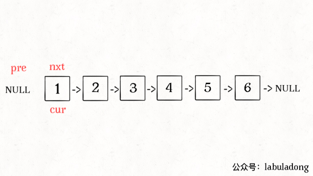

## 链表反转递归题解
> ### 全部反转
> 递归思路解决问题
> <br> 递归到最后一个元素，把后面元素指向前一个元素，返回最后一个元素
> <br>关键代码如下
```java
  public ListNode reverseList(ListNode head) {
        if (head == null) return null;
        if (head.next == null) return head;
        ListNode last = reverseList(head.next);
        head.next.next = head;
        head.next = null;
        return last;
    }
```

> ### 部分反转
> 上述代码的一种变形
> <br> 首先看看一种翻转前n个节点该怎么写，
```java
 public static ListNode reverseN(ListNode head, int n) {
        if (n == 1 || head.next == null) {
            next = head.next;
            return head;
        }
        ListNode last = reverseN(head.next, n - 1);
        for (int i = n; i > 0; i--) {
            System.out.println(" ");
        }
        System.out.println("next:" + next.val + ", n:" + n);
        System.out.println("head:" + head.val + ", n:" + n);
        head.next.next = head;
        head.next = next;
        return last;
    }
```
> 找到第n个节点，开始翻转就行了，同时记录下n节点后面的节点，把头节点链接过去
> 
> 现在我们看看区间的节点翻转，如果左区间==1那就太好了直接用翻转前n个节点的代码
> <br> 如果比较不幸也没有关系直接一个 head.next = fun(head.next,left - 1,right -1)强行推进
> 看看代码
```java
   public static ListNode reverseBetween(ListNode head, int left, int right) {
        if (left == 1) {
            return reverseN(head, right);
        }
        head.next = reverseBetween(head.next, left - 1, right - 1);
        return head;
    }
```
> while便利都在图里了 太猛了 顶不住 


>